> TL;DR: Making an ICO, 2019 edition

## Once Upon a Time...

When talking about issuing tokens, the _de facto standard_ is to implement a [ERC20 standard compatible token](https://github.com/ethereum/EIPs/blob/master/EIPS/eip-20.md). By implementing it, you guarantee it can be easily added to any Ethereum wallet and easily integrated to any exchange or payment system.

One naive approach nowadays would be to implement it from scratch. Instead, [OpenZeppelin](https://openzeppelin.org/) has been providing a [standard, security audited, time tested implementation](https://github.com/OpenZeppelin/openzeppelin-solidity/blob/master/contracts/token/ERC20/ERC20.sol).

Even better, today we have a reusable, upgradable, already deployed version of all their contracts through [ZeppelinOS](https://zeppelinos.org/).

---

> If you are curious about how smart contract upgrades are handled using the proxy pattern, please read [here](https://blog.colony.io/writing-upgradeable-contracts-in-solidity-6743f0eecc88/) and [here](https://blog.zeppelinos.org/proxy-patterns/).

---

## Creating a Fictitious Coin using ZeppelinOS

Without further ado, let's create a fictional token using ZeppelinOS and deploy it in a local chain. This tutorial follows closely the [ZeppelinOS quickstart](https://docs.zeppelinos.org/docs/deploying.html). It also assumes that you are using [MetaMask](https://metamask.io/) version 6 (the UI may differ between versions) and a modern version of npm (6.8.0 as of this writing).

Let's begin with the hardest and most important step when developing of any token: giving it a good name 🤔.

Maybe I should use [memes](https://dogecoin.com/) or [japanese characters](https://coinmarketcap.com/currencies/gokucoin/) as an inpiration? Maybe [LemonCoin](https://www.youtube.com/watch?v=XVZxjVJz4ds) could be a good name? 🍋

Since this blog supports the [#BUIDL movement](https://twitter.com/vitalikbuterin/status/971417459872882690), let's call it _#BUIDLcoin_.

`youtube:https://www.youtube.com/embed/PluyYPXA4Zc`

> You can sing it too, I'll wait 🎤

---

The first step is to create the #BUIDLcoin project and initialize the ZeppelinOS project.

```bash
$ mkdir buidlcoin && cd buidlcoin
```

Initialize the npm project:

```bash
$ npm init -y
```

Install the required modules using npm (and go grab some ☕️️):

```bash
$ npm i zos zos-lib truffle truffle-hdwallet-provider dotenv
```

Initialize the ZeppelinOS project:

```bash
$ npx zos init buidlcoin
```

Link the openzeppelin-eth module. It differs from the traditional openzeppelin-solidity in that their contracts are already deployed in all testnets and mainnet as [EVM packages, so their code can be reused instead of redeployed by each user](https://blog.zeppelin.solutions/getting-started-with-openzeppelin-eth-a-new-stable-and-upgradeable-evm-package-576fb37297d0).

```bash
$ npx zos link openzeppelin-eth
```

Now let's start a local blockchain instance using ganache-cli in another terminal. You should see an output like this:

```bash{6,19}
$ ganache-cli -p 9545 --deterministic
Ganache CLI v6.2.5 (ganache-core: 2.3.3)

Available Accounts
==================
(0) 0x90f8bf6a479f320ead074411a4b0e7944ea8c9c1 (~100 ETH)
(1) 0xffcf8fdee72ac11b5c542428b35eef5769c409f0 (~100 ETH)
(2) 0x22d491bde2303f2f43325b2108d26f1eaba1e32b (~100 ETH)
(3) 0xe11ba2b4d45eaed5996cd0823791e0c93114882d (~100 ETH)
(4) 0xd03ea8624c8c5987235048901fb614fdca89b117 (~100 ETH)
(5) 0x95ced938f7991cd0dfcb48f0a06a40fa1af46ebc (~100 ETH)
(6) 0x3e5e9111ae8eb78fe1cc3bb8915d5d461f3ef9a9 (~100 ETH)
(7) 0x28a8746e75304c0780e011bed21c72cd78cd535e (~100 ETH)
(8) 0xaca94ef8bd5ffee41947b4585a84bda5a3d3da6e (~100 ETH)
(9) 0x1df62f291b2e969fb0849d99d9ce41e2f137006e (~100 ETH)

Private Keys
==================
(0) 0x4f3edf983ac636a65a842ce7c78d9aa706d3b113bce9c46f30d7d21715b23b1d
(1) 0x6cbed15c793ce57650b9877cf6fa156fbef513c4e6134f022a85b1ffdd59b2a1
(2) 0x6370fd033278c143179d81c5526140625662b8daa446c22ee2d73db3707e620c
(3) 0x646f1ce2fdad0e6deeeb5c7e8e5543bdde65e86029e2fd9fc169899c440a7913
(4) 0xadd53f9a7e588d003326d1cbf9e4a43c061aadd9bc938c843a79e7b4fd2ad743
(5) 0x395df67f0c2d2d9fe1ad08d1bc8b6627011959b79c53d7dd6a3536a33ab8a4fd
(6) 0xe485d098507f54e7733a205420dfddbe58db035fa577fc294ebd14db90767a52
(7) 0xa453611d9419d0e56f499079478fd72c37b251a94bfde4d19872c44cf65386e3
(8) 0x829e924fdf021ba3dbbc4225edfece9aca04b929d6e75613329ca6f1d31c0bb4
(9) 0xb0057716d5917badaf911b193b12b910811c1497b5bada8d7711f758981c3773

HD Wallet
==================
Mnemonic:      myth like bonus scare over problem client lizard pioneer submit female collect
Base HD Path:  m/44'/60'/0'/0/{account_index}

Gas Price
==================
20000000000

Gas Limit
==================
6721975

Listening on 127.0.0.1:9545
```

The `--deterministic` flag makes it use a predefined mnemonic so you can follow this example easily. The _Available Accounts_ is a list of predefined accounts, each one with 100 ETH preloaded. Note the first address (0), we will use it as the initial owner of all our tokens: `0x90f8bf6a479f320ead074411a4b0e7944ea8c9c1`.

We use port `9545` because that is what the generated `truffle-config.js` file uses for the `local` network. Take a look yourself:

```bash{1,4,6}
$ cat truffle-config.js
module.exports = {
  networks: {
    local: {
      host: 'localhost',
      port: 9545,
      gas: 5000000,
      gasPrice: 5e9,
      network_id: '*',
    }
  }
}
```

Since we are using a local blockchain instance, we need to deploy the EVM packages manually. This step is not necessary on testnet/mainnet.

```bash
$ npx zos push --deploy-dependencies --network local
```

Now let's create a proxy instance for the provided `StandaloneERC20` contract. We also initialize it so that the `0x90f8bf6a479f320ead074411a4b0e7944ea8c9c1` address is the unique owner of 1 #BUIDLcoin, and only this address can create more coins and pause the contract.

---

> Please refer to the [contract source code](https://github.com/OpenZeppelin/openzeppelin-eth/blob/master/contracts/token/ERC20/StandaloneERC20.sol) for the initialization parameters, but basically we define the token symbol, name, decimals, initial issuance and permissions.

---

```bash{13}
$ OWNER="0x90f8bf6a479f320ead074411a4b0e7944ea8c9c1"
$ npx zos create --network local openzeppelin-eth/StandaloneERC20 \
  --init --args BUIDLcoin,BUIDL,18,1000000000000000000,$OWNER,\[$OWNER],\[$OWNER]
Creating proxy to logic contract 0x254dffcd3277C0b1660F6d42EFbB754edaBAbC2B and initializing by calling initialize with:
 - name (string): "BUIDLcoin"
 - symbol (string): "BUIDL"
 - decimals (uint8): "18"
 - initialSupply (uint256): "1000000000000000000"
 - initialHolder (address): "0x90f8bf6a479f320ead074411a4b0e7944ea8c9c1"
 - minters (address[]): ["0x90f8bf6a479f320ead074411a4b0e7944ea8c9c1"]
 - pausers (address[]): ["0x90f8bf6a479f320ead074411a4b0e7944ea8c9c1"]
Instance created at 0x21a59654176f2689d12E828B77a783072CD26680
0x21a59654176f2689d12E828B77a783072CD26680
Updated zos.dev-1551084874004.json
```

Aaand, that's it! The contract is now live on the local blockchain.

Before we continue, note the highlighted line in our output containing the `0x21a59654176f2689d12E828B77a783072CD26680` address. We will need it later. This address will be different on each run, it is the proxy contract address.

---

We can check in MetaMask that our address own the tokens. First connect it to the ganache network using the custom network option.


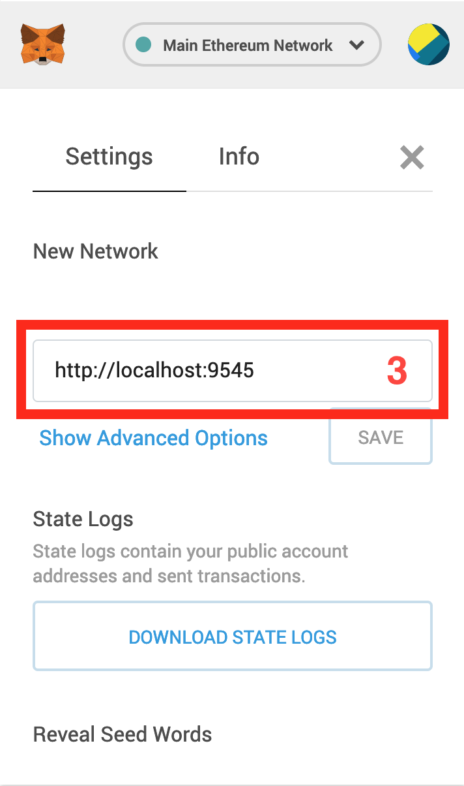

Now import the private key of our first deterministic address (`0x4f3edf983ac636a65a842ce7c78d9aa706d3b113bce9c46f30d7d21715b23b1d`) as an account in MetaMask.

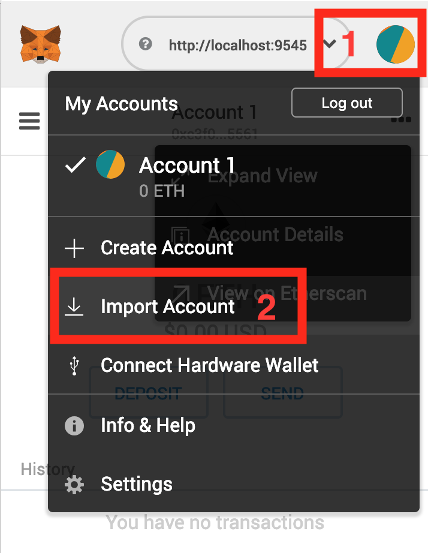

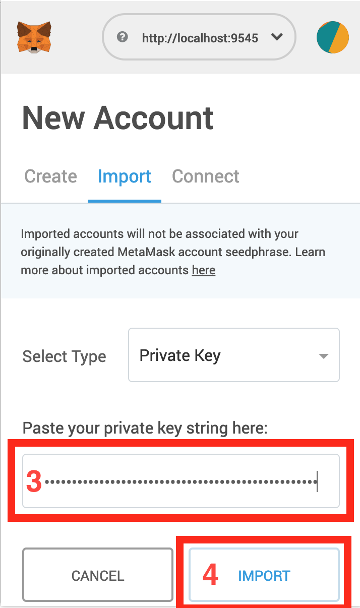

You should confirm that this address has ~100 fictitious ETH.

I **strongly** suggest that you rename this account to something like _"Ganache 0"_ so you can remember in future this is for testing purposes only.

---

> **NEVER EVER USE THIS ACCOUNT FOR REAL WORLD TRANSACTIONS!!!!!11ONE**

---

Now let's take the token contract address we got previously from running `npx zos create` and add it to MetaMask.

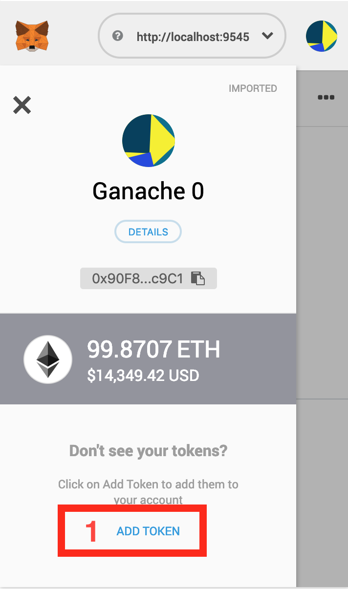

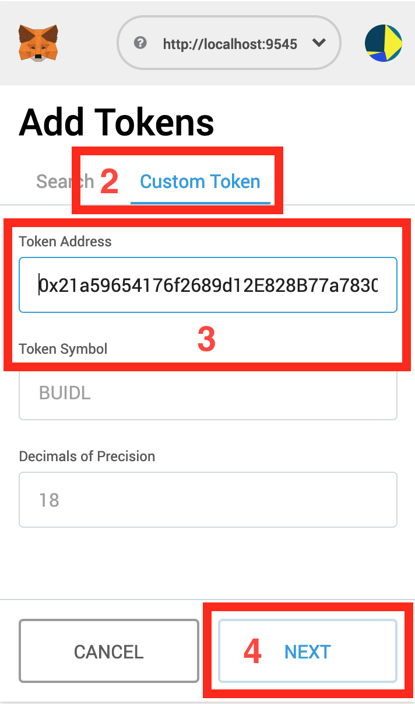

Note that pasting the contract address will autofill the token symbol and decimals automatically. MetaMask will get them from the ERC20 token metadata.

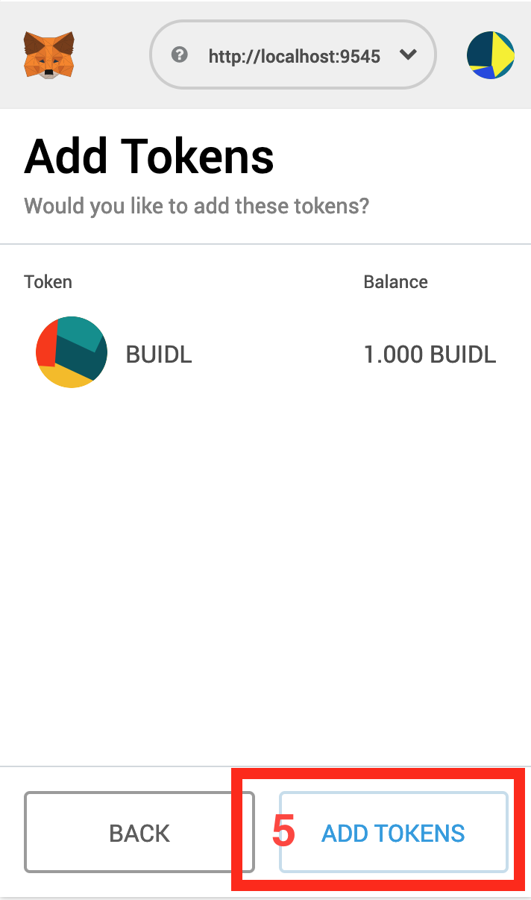

You should confirm that our address owns all issued tokens. You should also be able to make transfers to other addresses as well.

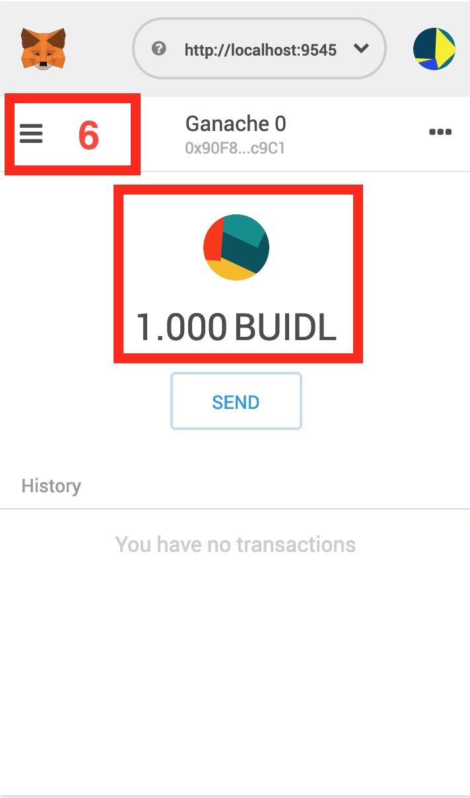

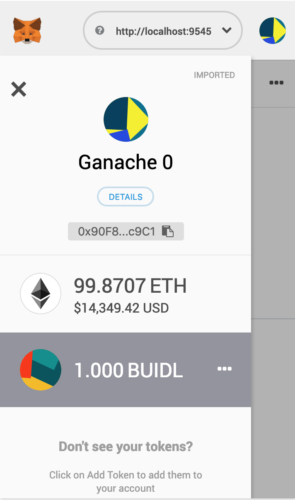

---

## Deploying our #BUIDLcoin on Ropsten Testnet

Since we are just reusing the OpenZeppelin logic contracts code as-is and creating a proxy around it, we don't even have to push them to the other chains, their existing address will be provided through the linking process.

We'll just create the proxy contract which will give us a stable address with an upgradable implementation.

For the on-chain contract creation, I will use an account I already have from MetaMask with some testnet ETH (get some test coins [here](https://faucet.ropsten.be/)). Just for testing purposes, I will export the private key from MetaMask and paste it into a configuration file.

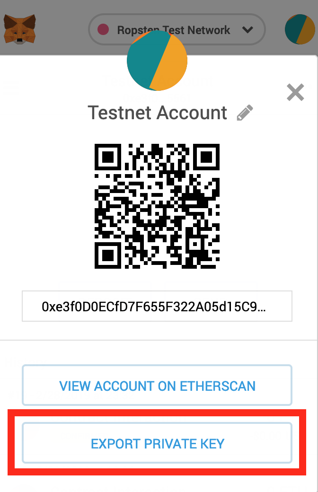

Also we will use [Infura.io](https://infura.io/) to access the testnet. Create an account there if you already don't have and get your project ID.

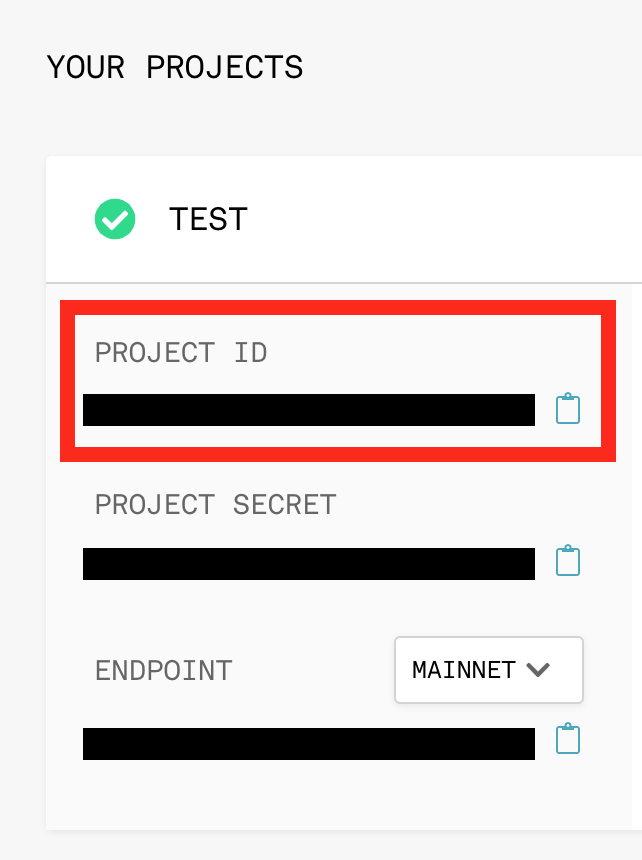

Create a `.env` file in your project's root containing the following configuration:

```
ROPSTEN_PRIVATE_KEY="<paste here your private key from MetaMask>"
INFURA_KEY="<paste here your Infura project ID>"
```

---

> **REMEMBER TO NEVER EVER COMMIT THIS FILE INTO THE SOURCE CODE REPOSITORY**

---

Now add the ropsten configuration to `truffle-config.js`. We will use the `HDWalletProvider` implementation in single private key mode pointing to Infura to get access to the ropsten testnet.

```js{1,3,14-23}
require("dotenv").config();

const HDWalletProvider = require("truffle-hdwallet-provider");

module.exports = {
  networks: {
    local: {
      host: "localhost",
      port: 9545,
      gas: 5000000,
      gasPrice: 5e9,
      network_id: "*"
    },
    ropsten: {
      provider: function() {
        return new HDWalletProvider(
          process.env.ROPSTEN_PRIVATE_KEY,
          `https://ropsten.infura.io/v3/${process.env.INFURA_KEY}`
        );
      },
      network_id: "3",
      gas: 5000000
    },
  }
};
```

Initialize the `zos.ropsten.json` file:

```bash
$ npx zos push --network ropsten
```

Create the proxy contract. The `$OWNER` variable is a ropsten testnet address I own which will be the owner of 1 BUIDL which will be created at the contract initialization. You must change it if you want to try yourself.

```bash
$ OWNER="0x85c1b284b1b93a3718312f84d0548580b40ada11"
$ npx zos create --network ropsten openzeppelin-eth/StandaloneERC20 \
  --init --args BUIDLcoin,BUIDL,18,1000000000000000000,$OWNER,\[$OWNER],\[$OWNER]
```

As in the local chain execution, it will output the ERC20 contract address, the only difference is that now you can check it in Etherscan, for example.

---

### Deploying our #BUIDLcoin on Mainnet

For Mainnet, it is the same procedure, but for security reasons I'll use a different account.

Create a configuration named `mainnet` in `truffle-config.js` with the `network_id: "1"`. And, of course, your account must have real ETH 💸.

Initialize the `zos.mainnet.json` file:

```bash
$ npx zos push --network mainnet
```

Create the proxy contract:

```bash
$ OWNER="0x3Ad99193f92B12fA3a9c4E8b27976d4d9a5Cb8C1"
$ npx zos create --network mainnet openzeppelin-eth/StandaloneERC20 \
  --init --args BUIDLcoin,BUIDL,18,1000000000000000000,$OWNER,\[$OWNER],\[$OWNER]
Deploying new ProxyAdmin...
Deployed ProxyAdmin at 0x1d301421F2B9cf0D0d046f725c103c0ca29c631D
Creating proxy to logic contract 0x87C55d3E4B41f8fe48BCc32a50b86434323460C1 and initializing by calling initialize with:
 - name (string): "BUIDLcoin"
 - symbol (string): "BUIDL"
 - decimals (uint8): "18"
 - initialSupply (uint256): "1000000000000000000"
 - initialHolder (address): "0x3Ad99193f92B12fA3a9c4E8b27976d4d9a5Cb8C1"
 - minters (address[]): ["0x3Ad99193f92B12fA3a9c4E8b27976d4d9a5Cb8C1"]
 - pausers (address[]): ["0x3Ad99193f92B12fA3a9c4E8b27976d4d9a5Cb8C1"]
Instance created at 0xeE3CA8C8B5Ea3c2Aa293B0fD2E61B3638D953241
0xeE3CA8C8B5Ea3c2Aa293B0fD2E61B3638D953241
Updated zos.mainnet.json
```

This is the real output, note that the contract address is `0xeE3CA8C8B5Ea3c2Aa293B0fD2E61B3638D953241`. If you [check it on Etherscan.io](https://etherscan.io/address/0xeE3CA8C8B5Ea3c2Aa293B0fD2E61B3638D953241), it is recognized as a ERC20 token address.

> And yes, I own almost all tokens and control the minter address #dumpit

---

## Adding Token Tracking to MetaMask (experimental)

So now we have our shining new token deployed on mainnet and want your users to track them in their wallets.

Most ERC20 compatible wallets have the option to manually add the contract address and other info.

For instance, if you paste our token contract address in MetaMask, it will automatically get the token symbol and decimals from contract metadata.

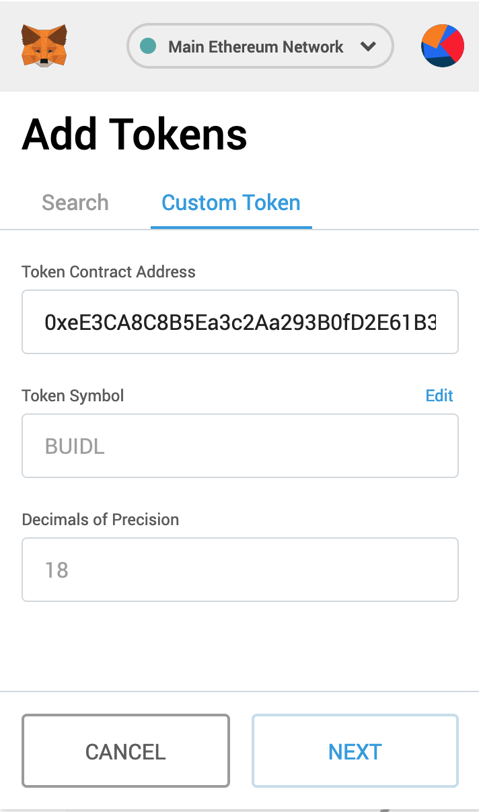

But there is an ongoing [EIP proposal](https://github.com/estebanmino/EIPs/blob/master/EIPS/eip-747.md) for a web3 API to suggest token tracking. It is already implemented as an vendor-specific experimental API in MetaMask.

For our token, the code should be something like this (with the advantage of being able to provide a fancy image of a Llamacorn as token icon):

```js
window.web3.currentProvider.sendAsync({
  method: "metamask_watchAsset",
  params: {
    type: "ERC20",
    options: {
      address: "0xeE3CA8C8B5Ea3c2Aa293B0fD2E61B3638D953241",
      symbol: "BUIDL",
      decimals: 18,
      image:
        "https://blog.decentralizing.me/llamacorn.jpg"
    }
  },
  id: 20
});
```

If you have MetaMask installed in your browser, click the following button to add #BUIDLcoin tracking to your account (mainnet):

<add-token-button/></add-token-button>

MetaMask will ask for a confirmation for security purposes, and by accepting it, your account should now track your BUIDL tokens.

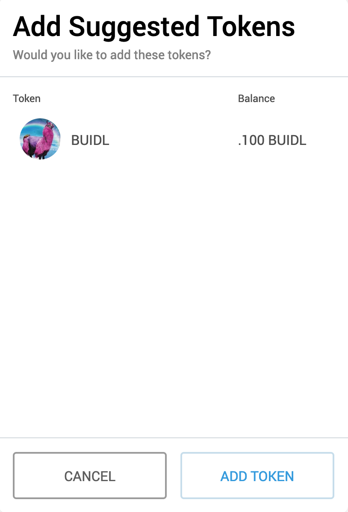

## Bonus: Gimme #BUIDLcoin

Just for some fun, I've implemented a quick-and-dirty faucet smart contract with some balance and a method where you can use to request some BUIDLcoins and play yourself, just click the next button and pay for the gas:

<request-token-button></request-token-button>

Each call will give you 0.0001 BUIDL.

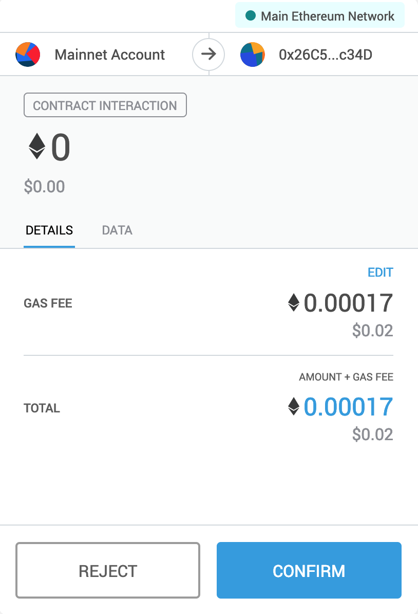
